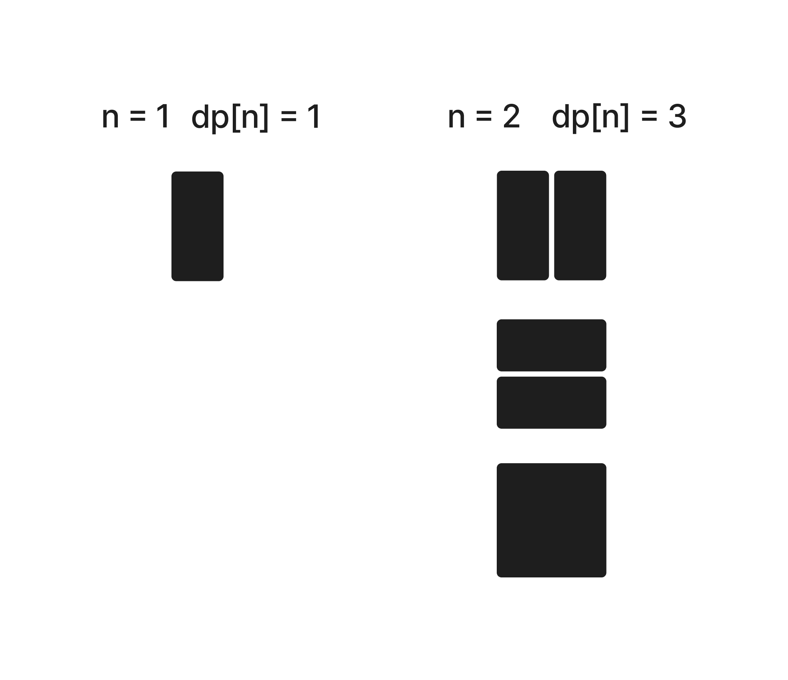
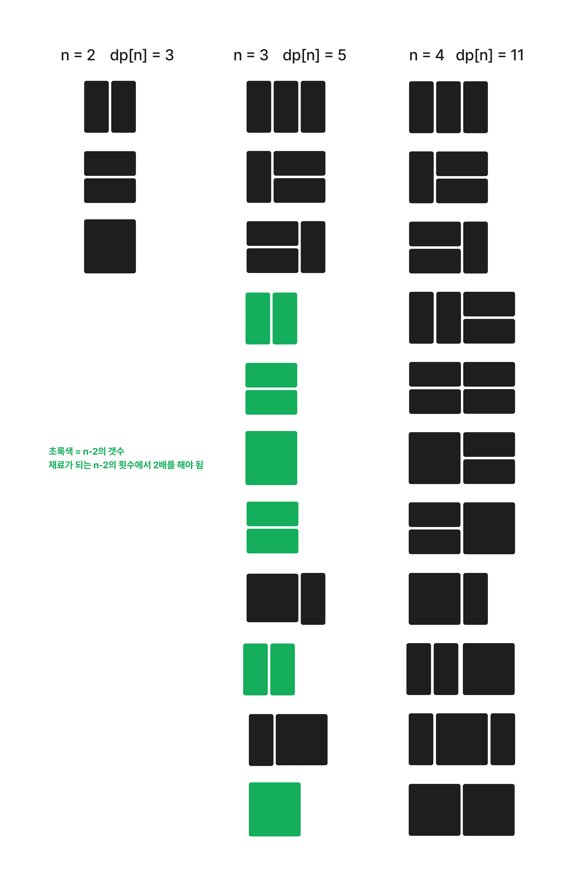

### 문제 설명

>n이 주어졌을 때, 2 x n의 직사각형을 채우는 방법의 수

아래는 2x17 칸을 채우는 한가지 예이다.

#### 문제 해설

11726을 응용하면 쉽게 풀 수 있는 문제이다.

아래는 1x2와 2x2 칸을 채운 방법이다.

| n | 기호 | 방법의 수 |
| --- | --- | ---- |
| 1 | `l` | 1 |
| 2 | `ll`, `=`, `ㅁ` | 3 |

`n=3` 일 경우, n-1과 (n-2)*2의 값을 조합하여 n을 구할 수 있다.

