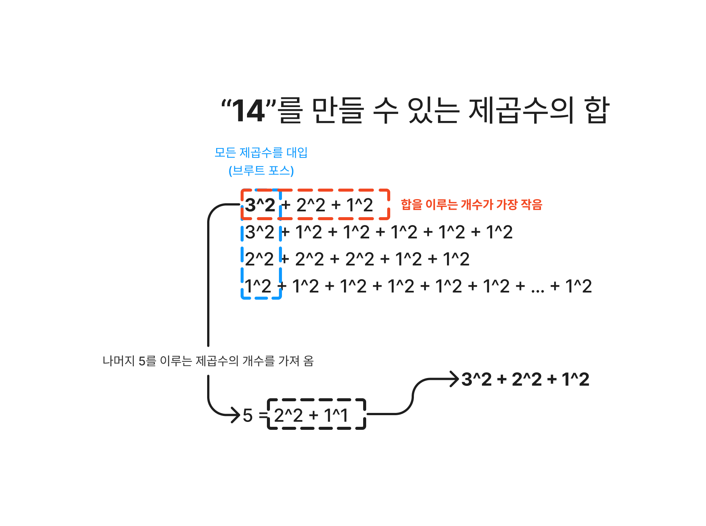

### 풀이

풀이 조건은 다음과 같다.

- ✅ 제곱수의 구성을 찾기
- ✅ 찾은 제곱수는 그 값을 구성하는 제곱수의 개수를 저장

#### 5의 값을 예로 들어보자

먼저 5를 만드는 모든 제곱수의 구성을 찾는다.

1. `5 = 1^2 + 1^2 + 1^2 + 1^2 + 1^2`
2. `5 = 2^2 + 1^2`

이 구성 중 제곱수의 개수가 적은 구성은 2번이다. 만약 값이 14라면?

1. `14 = 3^2 + 2^2 + 1^2`
2. `14 = 3^2 + 1^2 + 1^2 + 1^2 + 1^2 + 1^2`
3. `14 = 2^2 + 2^2 + 2^2 + 1^2 + 1^2`
4. `14 = 1^2 + 1^2 + 1^2 + 1^2 + 1^2 + 1^2 + ... + 1^2`

14를 이루는 구성에 3의 제곱수가 등장했다. 만약 `14 - 3^2 = 5`이면, 5는 이미 연산이 완료된 값이다. 여기서 DP가 필요함

따라서 새로운 제곱수 `3^2`에서 이미 연산이 완료된 `5 = 2^2 + 2^1`를 가져와서 값을 구할 수 있다.

##### _DP 배열_

- dp[1] = 1
- dp[2] = 2
- dp[3] = 3
- dp[4] = 1
- dp[5] = 2
- dp[6] = 3
- dp[7] = 4
- dp[8] = 2
- dp[9] = 1
- dp[10] = 2
- ...
- dp[13] = 2
- dp[14] = 3